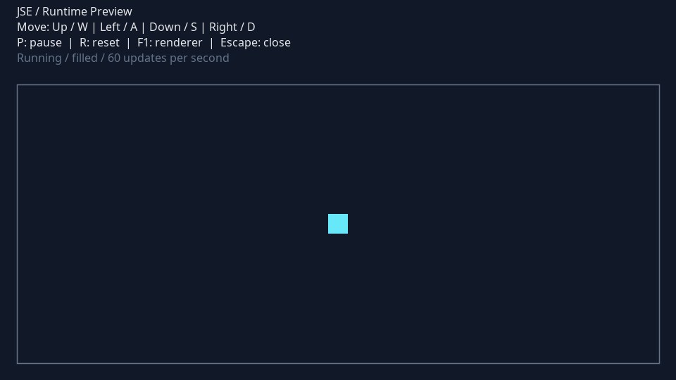

# Java Simple Engine

JSE is a compact Java 17 runtime for 2D desktop applications. It provides fixed updates, scene lifecycle, keyboard actions and interchangeable Java2D rendering. A configurable preview runs independently of the planned Arena game.



## Build and run

Install **JDK 17 or newer**. The Maven Wrapper selects Maven 3.9.9; the first build downloads build dependencies. Production code uses the JDK only.

```sh
./mvnw clean verify
java -jar target/jse-demo.jar
```

On Windows, replace `./mvnw` with `mvnw.cmd`. The packaged application runs without Maven, an IDE or a network connection. A desktop display is required for the window. Tests and help work without a display:

```sh
java -Djava.awt.headless=true -jar target/jse-demo.jar --help
```

The preview supports movement with WASD or arrows, **P** to pause/resume, **R** to reset, **F1** to switch Filled/Wireframe rendering and **Escape** to close. Losing window focus clears input and pauses movement; press P after returning. Reset centers the object and resumes movement.

## Configuration

Defaults live in [jse.properties](src/main/resources/jse.properties). Supply a UTF-8 file containing only the values to override:

```properties
window.width=1024
window.height=640
preview.speed=300
render.mode=WIREFRAME
input.move_up=I,UP
```

```sh
java -jar target/jse-demo.jar --config preview.properties
```

Unknown keys, conflicting bindings, invalid colors and layouts that cannot fit the object are rejected before startup. Resource paths are relative to the classpath; configured sprites are preloaded before the update timer starts.

## Project status

The runtime foundation is implemented: window, fixed updates, lifecycle, input, geometry, resource cache, Bridge graphics and two working renderers. The preview is the current executable example.

The Arena game, themed factories, AI, events and graphical decorators are specified for subsequent milestones. Empty game package declarations reserve namespaces; they do not represent implemented game modules. See [development status](docs/Development-Status.md) for completed work and the next handoff.

## Team

| Contributor | Responsibility | Design patterns |
| --- | --- | --- |
| Sabirzhanov Emil | Runtime, desktop host, input, rendering, assets, rendering showcase | Bridge; Decorator |
| Baktiyarova Aruzhan | Game object model, spawners, Forest/Space families, arena layout | Factory Method; Abstract Factory |
| Roziyeva Yasmina | World, AI, collisions, events, rules, game scenes and observers | Strategy; Observer |

Bridge is already implemented. The other five patterns are planned; their intended structures and acceptance checks are documented individually.

## Documentation

- [Technical specification](docs/JSE-Technical-Specification.md): scope, contracts, game behavior and acceptance criteria.
- [Implementation plan](docs/Implementation-Plan.md): completed foundation steps and team milestones.
- [Integration guide](docs/Integration-Guide.md): concrete boundaries for parallel development.
- [Runtime design](docs/design/Runtime-Foundation.md): lifecycle and timing decisions.
- [Verification](docs/Verification.md): commands, results and practical limits.
- [Contributing](CONTRIBUTING.md) and [GitHub setup](docs/GitHub-Setup.md).

[Runtime architecture](docs/uml/rendered/runtime-architecture.svg) describes existing code. The other UML diagrams are explicitly marked as planned game integration.
